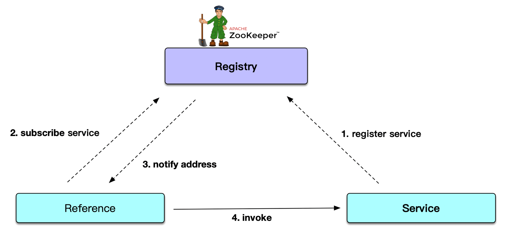

Sofa Spring Boot Demo
=====================

A Spring Boot demo with Sofa Boot and Sofa RPC.

# What is SofaBoot?

SOFABoot is a development framework open sourced by Ant Financial which is based on Spring Boot, provides capabilities such as Readiness Check, class isolation, and log space
isolation. In addition to enhancing the Spring Boot, SOFABoot provides users with the capability to easily use SOFA middleware in Spring Boot.

# What is SofaRPC?

SOFARPC is a Java-based RPC service framework open sourced by Ant Financial, which provides remote service call between applications, high scalability and fault tolerance features.
Currently, all RPC calls of Ant Financial businesses use SOFARPC. SOFARPC provides users with functions such as load balancing, traffic forwarding, link tracing, link data
transparent transmission, and fault removal.

# Project Structure

* service-api: service interface contract definition
* provider: service implementation
* consumer: service consumer

# Get Started

* Start ZooKeeper service by `docker-compose up -d`
* Start Service Provider: `SofaBootServiceProvider`
* Start Service Consumer: `SofaBootServiceConsumer`
* Test REST API with Sofa RPC call: `curl http://localhost:9080/user/1`

# Architecture

* Service Registry: Zookeeper with Curator 4.3.0

# References
 
* SOFAStack: https://www.sofastack.tech/en/
* SOFABoot: https://www.sofastack.tech/en/projects/sofa-boot/overview/
* SOFARPC: https://www.sofastack.tech/en/projects/sofa-rpc/overview/